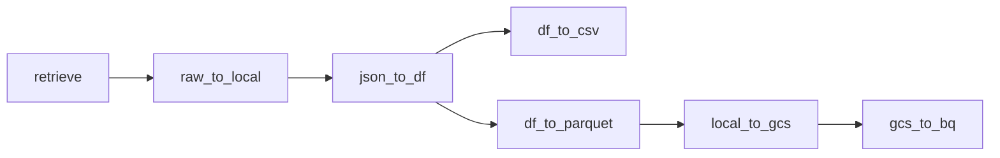

# Airflow & dbt, dockerised !

This project is to serve as an example and teaching material on how to set up Airflow to run dbt tasks in a dockerised environment. There are quite a few challenges to face and some of the solutions might **not** be *'production ready'* as it is vastly dependant on variations which are out of scope for this project, such as internal standards, secret management and so on. The project also includes an example dag to fetch and load data from an API which was used to accumulate data for teaching purpose.

## What is covered

 - Running Airflow in Docker
 - Running dbt via DockerOperator in Airflow
 - A workaround solution how to pass credential file to the dbt container
 - Terraform IaC brief and how it was used in the project
 - GCP project setup
 - dbt incremental loading
 - dbt multiple environment setup (dev/prod)
 

## The gig

You land a job in an investment group/broker which is looking to expand their offerings with the new **Bitcoin ETF** and upcoming **Ethereum ETF**. You are tasked to collect the price for both of these crypto coins to be used by various analysts and ML team to train their models to make predictions.

## Constraints

After discussions and planning with the Project Manager you settled on using well-know technologies for the pipeline.
As you can guess already: it consists of Docker, Airflow, dbt, Terraform, and GCP. You also suggested to use CoinMarketCap.com API to be used as the data provider. They are well established, long running, and already provide some calculated values that cloud be used in analysis, such as price percentage change over 24 hours and so on.

# Preparations

## Airflow container
In the project you will find a 'docker-compose.yml' file in 'Airflow' folder that we'll be using for the example. It is a slightly modified default configuration provided by Apache Airflow (https://airflow.apache.org/docs/apache-airflow/2.8.1/docker-compose.yaml).

### Modifications

 In the 'x-airflow-common' 'volumes' are two additional lines:

    - /var/run/docker.sock:/var/run/docker.sock #To run DockerOperator

    - shared-creds-volume:/opt/airflow/shared	#Shared volume to store credentials
At the very bottom under 'volumes'

    shared-creds-volume: #Named volume we bind above
	 
One issue that can arise when trying to run 'DockerOperator' via dockerised Airflow are permissions. Simple solution is to set 'user: "${AIRFLOW_UID:-50000}:0"' to '0' and let it run as 'root'.
This can be a problem depending on the organisations standards and if there's an existing Airflow environment set up. You'd have to tailor it for the specifics yourself but it's a good starting point.
### shared-creds-volume
The reason I am creating and binding the volume is the solution I figured out when I had to somehow pass the credentials file to the dbt container instantiated with 'DockerOperator'. I am not using any 3rd party tools to manage it so this was the most straightforward way I came up with. I will cover it more later.
## Terraform & GCP
Terraform is an Infrastructure as Code (IaC) tool widely used in the industry to provision resources in various cloud platforms. For this project I chose GCP (Google Cloud Platform) as I'm most familiar with it.
If you don't have Terraform installed you can get started here: https://developer.hashicorp.com/terraform/install?product_intent=terraform
Once installed you will have to modify the provided Terraform 'variables.tf' file for your GCP project.
At first the tool can feel counter-productive at least when working with GCP as you still have to manually (using cloud console) create the GCP project and enable all the services needed for the project to work.
### GCP
As mentioned before you need to start by either creating a new GCP project or ask your superior if there's one already in place that you should use.
When you have access to the GCP project or created a new one - Terraform will need a 'service account' in order to work. This can be done via the 'IAM and admin' -> 'service accounts' panel. The service account should get the roles of 'Project editor' and 'IAM Security Admin'. Once created you need to generate a JSON key under 'Keys' tab and save it somewhere accessible for the project (in the project folder should be fine, again, it can depend per organisation).
Then you need to enable 'BigQuery' and 'Cloud Storage' products as the project requires them to function.
BigQuery & Cloud Storage will be used as the data warehouse solutions.
### Terraform
Now that you have the service account and JSON key file you need to modify 'variables.tf' file to match your GCP project id, region, and path to the key file.
Once done you need to run `terraform apply` command in the terminal (the working path has to be the project folder). This will set up the needed resources and will create an additional service account that will be used for Airflow and dbt with permissions set only to access BigQuery and Cloud Storage.
There is one nifty trick you can now do to get the JSON key file for this new service account, you can run `terraform output service_account_credentials > ./Airflow/config/shared_creds/gcp_default_output.json` to return the file. This will store it in a folder that the Airflow dag will copy from into the shared volume we set up.
***Note:*** I am running the project on Windows machine and there's a small problem of the file being encoded in UTF-16 and it needs to be in UTF-8. Fastest way is just creating 'gcp_default.json' file in the same folder as above (/Airflow/config/shared_creds/) and then just pasting in the JSON part from the 'gcp_default_output.json' file. I have not tested it on different OS yet but you can try to run it just by renaming the 'gcp_default_output.json' to 'gcp_default.json'. Better solution pending!
If you make any updates to the terraform files you have to rerun the `terraform apply`.

## Airflow connections & variables
There are a couple of connections and variable to be set up for the pipeline to work.
### Connections
First you need to create a 'Google cloud' connection and name it "google_cloud_default". Fill in 'project id' and 'keyfile path' with equivalent information.
Next create a 'File (path)' connection and name it "fs_default" and save it, no need to fill in anything else. This is used to write files to disk.
### Variables
"bq_raw_dataset" - name of the dataset in BigQuery from the API.
"CMC_API_KEY" - CoinMarketCap API key. You need to register a developer account to get one.
"gcp_default_project_id" - your Cloud project ID.

## dbt
For dbt you need to update '/dbt/.dbt/profiles.yml' file. Update the 'project' attribute with your Cloud project id.
Then update '/dbt/cmc_elt/models/staging/cmc/src_raw_cmc_data.sql' with your Cloud project id, dataset and table names.
Then copy and paste the key file from './Airflow/config/shared_creds/', **and make sure it is named *"gcp_default.json"***.
You will have to build and publish your own image. Run `docker build -t yourhubname/yourimagename:0.1 .`,
then you have to push it to a repository, I'm using Dockerhub for this project but it might be different per organisation. For Dockerhub you first have to log in by running `docker login` and providing the credentials of your Dockerhub account. Then you can run `docker push yourhubname/yourimagename:0.1` to publish the image. We need to do this in order to run DockerOperator.
This leads to one change that has to be made in one of the dags. Open 'Airflow/dags/dbt-elt-cmc-data.py' and update this line `image="justinaslorjus/dbt_cmc_elt:0.1.1",` with the name of your image.
**Remember - if you make any changes to the files in 'dbt' folder you will have to rebuild and republish the image.**

# The learning part
I will now write about the things there are to learn from this project. Even though the setup part alone has a learning curve I will try to explain why I did some things this way.
### The shared volume, again.
Working with Docker alone can be a difficult task at first. It becomes even harder when there's a need to run docker images with a dockerised Airflow (inception deepens!). The biggest hurdle is how to pass files (like credential JSON files) to the container without having to build them into the image we want to run (the dbt image) as it can cause security issues, especially for public images. One solution that I figured out without 3rd party implementation is to have a folder under Airflow project structure, in this case the folder is called 'shared', bind it to a named docker volume (the 'shared-creds-volume'), and then have a task in the dag to copy over the files we need in the image launched by DockerOperator.

This is how it can be done:
```python
@task()
def  copy_file(source_path: str, destination_path: str):
	"""
	This has to handle shared creds.
	"""
	try:
		shutil.copy(source_path, destination_path)
		print(f"File copied from {source_path} to {destination_path}")
	except  Exception  as  e:
		print(f"Error copying file: {e}")
```
Then we mount the volume in the DockerOperator like this:
```python
@task()
def  dbt_run():
	"""
	Executes 'dbt -d run --target prod'
	"""

	operator  = DockerOperator(
		task_id="dbt_run_task",
		image="justinaslorjus/dbt_cmc_elt:0.1.1",
		trigger_rule="none_failed",
		command=["-d", "run", "--target", "prod"],
		auto_remove=True,
		mount_tmp_dir=False,
		mounts=[
			Mount(source=f"airflow_shared-creds-volume", target="/shared_creds", type="volume"),
		],
	)

	operator.execute(context=None)
```
Pay attention to the 'mounts'. You would think why not have the source to the keyfile path directly but the issue is you would have to hardcode the full path on the host machine because a dynamic path (like **os.abspath()** ) will point to an inner path of the Airflow container (*/opt/airflow/..*). And since we are running another container it will not have access to it.
But by mounting the named volume to the newly instantiated container we can access data from both containers. Target is matching to the path in 'profiles.yml' dbt file `keyfile: /shared_creds/gcp_default.json`. 
Inspect the 'Airflow/dags/dbt-elt-cmc-data.py' file for full implementation. It could be improved by having sensors and using Airflow Variables in need of more sophistication.
### API data pipeline
Even though it is not the main topic I will cover some of the decision behind the pipeline to fetch and load data from CoinMarketCap API.
The dag looks like this:


 1. First task makes a call to API endpoint and returns the response text.
 2. raw_to_local takes that text and dumps a JSON file to the local disk.
 3. json_to_df reads the local file, converts it to a Pandas Dataframe and does a minor transformation.
 4. Then we convert this Dataframe to both a csv and a parquet file. csv is purely for debugging reasons.
 5. local_to_gcs gets the file path from df_to_parquet and uploads it to Google Cloud Storage bucket. This way we have an easy way to load the data to BigQuery with the provider operator.
 6. Last step takes the file path from local_to_gcs and appends the data to the table.
 
I chose to use parquet files as they work better with BigQuery. It is possible to skip raw_to_local and df_to_csv steps but I like to have the output as files for debugging and inspection.

If you open up the "fetch-cmc-data.py" dag file you may notice it is generating two dags dynamically:
```python
SYMBOLS  = ['BTC', 'ETH']
for  symbol  in  SYMBOLS:
	dag_id  =  f'cmc_price_{symbol}'
	@dag(dag_id=dag_id, start_date=START, schedule_interval='*/10 * * * *', catchup=False)
	def  cmc_api_etl():
```
One dag per symbol in the list, so if there's a need to add more coins to keep track of it's as simple as adding it's symbol to the list. Of course there's many ways to improve even this small feature with Variables or reading from .env file and so on. For simplicity I just chose to have a hardcoded list.
The interval is set to 10 minutes as I didn't want to run out of free API calls and can be reduced if there's a need of more frequent data - purchase of API plan can arise as free plan gives 10000 calls per month.
Even though it's possible to pass multiple symbols in one call, I thought this can serve as an example for dynamic dag setup and also gives more control via the Airflow web panel. 

## dbt
Let's dive into the dbt models, some of the concepts, and how to debug it faster without having to run it through Airflow.

### The layers

There are three layers in the project:

 - staging - loading the raw data to the warehouse.
 - intermediate - transformation layer.
 - marts - the top layer or the presentation layer.

Let's talk a little about the staging layer. Typically you use it to load the data into the warehouse and nothing more but I am using BigQuery for the API data pipeline and dbt ELT pipeline. That's strange... It means we already have the data in the warehouse? And the simple answer is yes, we do. I just really like using BigQuery! However I still have the staging layer and a model. It is materialised as a view so it acts as a passthrough to the raw data table. 
In the intermediate layer is where a couple of interesting things are happening. I implemented incremental load (yes, it's an overkill but good for practice and future-proofing) which led to surrogate key generation implementation. From the "code" point it seems quite simple:
```sql
select
*,
{{ dbt_utils.generate_surrogate_key(['symbol', 'last_updated']) }} as surrogate_key
from {{ ref ('stg_crypto_price')}}


where last_updated > (select  max(last_updated) from {{ this }})

```
But it's an essential part.
## SmartyPants

SmartyPants converts ASCII punctuation characters into "smart" typographic punctuation HTML entities. For example:

|                |ASCII                          |HTML                         |
|----------------|-------------------------------|-----------------------------|
|Single backticks|`'Isn't this fun?'`            |'Isn't this fun?'            |
|Quotes          |`"Isn't this fun?"`            |"Isn't this fun?"            |
|Dashes          |`-- is en-dash, --- is em-dash`|-- is en-dash, --- is em-dash|
